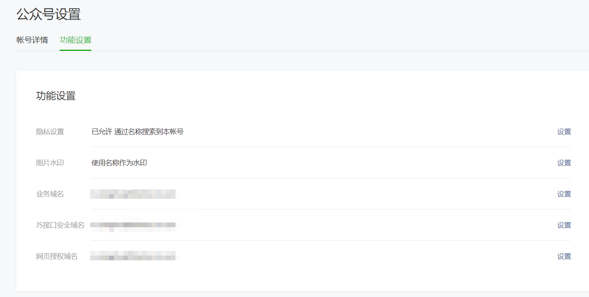
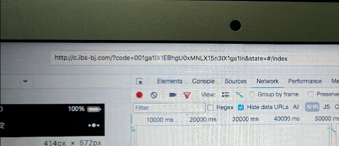

# wechat

>手把手实现微信网页授权和微信支付，附源代码（VUE and thinkPHP）

<h2 id="overview">概述</h2>

公众号开发是痛苦的，痛苦在好多问题开发者文档是没有提到的，是需要你`猜`的. 在开发过程中翻了好多的文档，都是说明其中的一部分问题的，很费时间,所以在此总结大体过程。我们模拟的是一个支付的商城，在实现购买过程中基本是把微信公众号`最主要模块`实现了，其余的功能我们没有涉及，但应该是触类旁通的。

**我们叙述的过程是按`开发流程`进行叙述的，不会是按照`开发文档`的形式叙述，希望您能结合[微信的开发文档](https://mp.weixin.qq.com/wiki?t=resource/res_main&id=mp1445241432)一起阅读，当然在流程中我们会提醒你阅读的部分**

## 目录

*   [概述](#overview)
    *   [解决的问题](#problem)
    *   [前端技术栈](#fontend)
    *   [后端技术栈](#rearend)
    *   [基本说明](#basicInstructions)
*   [开发过程]
    *   [0.准备](#ready)
    *   [1.基本配置](#basicConfiguration)
    *   [2.网页授权](#webauthorization)
*   [JS-SDK](https://github.com/iSAM2016/wechat/blob/master/JSSDK.md)
    *   [签名](https://github.com/iSAM2016/wechat/blob/master/JSSDK.md#-1-%E7%AD%BE%E5%90%8D)
    *   [签名后台](https://github.com/iSAM2016/wechat/blob/master/JSSDK.md#2-%E7%AD%BE%E5%90%8D-%E5%90%8E%E5%8F%B0)
    *   [签名前台](https://github.com/iSAM2016/wechat/blob/master/JSSDK.md#3-%E7%AD%BE%E5%90%8D%E5%89%8D%E5%8F%B0)
    *   [微信支付](https://github.com/iSAM2016/wechat/blob/master/JSSDK.md#3%E5%BE%AE%E4%BF%A1%E6%94%AF%E4%BB%98)

<h4 id="problem">解决的问题</h4>

- [x] 微信网页授权
- [x] 公众号支付
- [x] 公众号分享
- [x] 公众号扫一扫
- [x] 微信后台获取webapp(spa-vue)路由，导致 invalid 问题
- [x] 前端history.pushState()导致ios失效问题
- [x] 换取微信openID 顺序问题
- [x] 网页授权后强制登录官网账户，全局进行拦截


<h4 id="fontend">前端技术栈</h4>

vue2 + vuex + vue-router + webpack + ES6/7 + axios + sass + flex 

<h4 id="rearend">后端技术栈</h4>

thinkPHP3.2 + mysql + 阿里云Linux Ubuntu

<h4 id="basicInstructions">基本说明</h4>

> 开发环境 macOS 10.13.3   nodejs 8.0.0  centOS 7.4 

> 本文中使用的url是m.example.com (demo), 开发过程中需要替换成你的URL。

> 如有问题请直接在 Issues 中提，或者您发现问题并有非常好的解决方案，欢迎 PR

> 本着`线上线下一样`的原则，最好申请两个认证微信公众号，一个是发布使用，一个是本地开发使用。微信自带提供的微信测试功能也不太好用

> 可以添加群交流 544958637

## 开发过程

<h3 id='ready'>0.准备</h3>

请阅读以下微信开发者文档

[首页](https://mp.weixin.qq.com/wiki?t=resource/res_main&id=mp1445241432)

[开发者规范](https://mp.weixin.qq.com/wiki?t=resource/res_main&id=mp1421137025)

[公众号接口权限说明](https://mp.weixin.qq.com/wiki?t=resource/res_main&id=mp1433401084) 

[全局返回码说明](https://mp.weixin.qq.com/wiki?t=resource/res_main&id=mp1433747234) 

>附：参数说明

>appid：公众号唯一标识id（公众号-开发-基本配置中查看）。

>secret：公众号开发密钥（初次请保存本地，忘记请重置）。

>openid: 每个微信用户关注此公众号后会生成openid，并且在此公众号中每个用户得openid是唯一的。

>code ： code作为换取access_token的票据，每次用户授权带上的code将不一样，code只能使用一次，5分钟未被使用自动过期。

>IP 白名单:允许访问微信服务器的ip（linux 公网ip 注意如果服务器有CDN加速，CDN请添加白名单）


<h3 id='basicConfiguration'>1.基本配置</h3>
>  此部分对应文档的 [入门指引](https://mp.weixin.qq.com/wiki?t=resource/res_main&id=mp1472017492_58YV5) [接入指南](https://mp.weixin.qq.com/wiki?t=resource/res_main&id=mp1421135319)

1. 基础工具

    * 一个已经认证的公众号（就是你已经交300元）
    * 已经备案的域名
    * 域名解析到服务器 传送门[node项目发布+域名及其二级域名配置+nginx反向代理+pm2](https://www.jianshu.com/p/c781c108226a)
    * [微信开发者工具下载](https://mp.weixin.qq.com/wiki?t=resource/res_main&id=mp1455784140) : 微信开发可定使用这个工具。必须把前端代码放到》服务器上》用这个工具调试。请仔细阅读[微信web开发者工具 使用指南](https://mp.weixin.qq.com/wiki?t=resource/res_main&id=mp1455784140)

2. 设置`web开发者工具`

    在`开发-开发者工具-web开发者工具`设置开发者账号

3. 设置IP 白名单

    在`设置-安全中心-IP白名单设置你服务器的IP`，通过开发者ID及密码调用获取access_token接口时，需要设置访问来源IP为白名单。

4. 设置基本配置-开发者ID

    设置开发者密码（AppSecret）

    

    我们获取到的AppSecret (eg) a66b789009df271cde47aaaaaaa

5. 设置服务器基本配置 

    这部的目的是为了和微信服务器建立联系， 通过微信平台实现我们的业务逻辑。

    

    详细版：

    

    接入微信公众平台开发，开发者需要按照如下步骤完成：

    1、填写服务器配置

    2、验证服务器地址的有效性

    3、依据接口文档实现业务逻辑

    下面详细介绍这3个步骤。

    **第一步：填写服务器配置**

        * 登录微信公众平台官网后，在公众平台官网的开发-基本设置页面，勾选协议成为开发者，点击“修改配置”按钮、。

        * 填写服务器地址（URL）、Token和EncodingAESKey

        * URL是开发者用来接收微信消息和事件的接口URL。

        * Token可由开发者可以任意填写，用作生成签名（该Token会和接口URL中包含的Token进行比对，从而验证安全性）

        * EncodingAESKey由开发者手动填写或随机生成，将用作消息体加解密密钥。

        * 同时，开发者可选择消息加解密方式：明文模式、兼容模式和安全模式。模式的选择与服务器配置在提交后都会立即生效

        * 加解密方式的默认状态为明文模式，选择兼容模式和安全模式需要提前配置好相关加解密代码


<!--  -->


  **第二步：验证消息的确来自微信服务器**
​    
现在如果你点击`确认` 按钮，肯定会报认证错误。因为我们没有做`微信认证请求` 接收。  开发者提交信息后，微信服务器将发送GET请求到`填写的服务器地址URL`上，GET请求携带参数如下表所示：
​    

| 参数        | 描述                                       |
| --------- | ---------------------------------------- |
| signature | 微信加密签名，signature结合了开发者填写的token参数和请求中的timestamp参数、nonce参数。 |
| timestamp | 时间戳                                      |
| nonce     | 随机数                                      |
| echostr   | 随机字符串                                    |

开发者通过检验signature对请求进行校验（下面有校验方式）。若确认此次GET请求来自微信服务器，请原样返回echostr参数内容，则接入生效，成为开发者成功，否则接入失败。加密/校验流程如下：

1. 将token、timestamp、nonce三个参数进行字典序排序 
2. 将三个参数字符串拼接成一个字符串进行sha1加密 
3. 开发者获得加密后的字符串可与signature对比，标识该请求来源于微信


微信官方提供在文档中提供了PHP原生示例    [PHP原生验证demo](https://wximg.gtimg.com/shake_tv/mpwiki/cryptoDemo.zip)

**Thinkphp 3.2 验证示例**

```php
<?php
namespace Home\Controller;//命名空间注意用自己的
use Think\Controller; //引入Think Controller

/**
 * Class IndexController
 * @package Home\Controller
 * @name 微信服务器验证类
 * @author weikai
 */
class IndexController extends Controller {
	//微信服务器接入 
    public function index()
    {
        //这个echostr呢  只有说验证的时候才会echo  如果是验证过之后这个echostr是不存在的字段了
        if($_GET['echostr']){
            $echoStr = $_GET["echostr"];
            if ($this->checkSignature()) {
                ob_clean();//防止之前缓存区数据影响
                echo $echoStr;
                exit; 
            }
        }else{
            $this->responseMsg(); //如果没有echostr，则返回消息
        }
    }
    //验证微信开发者模式接入是否成功
    private function checkSignature()
    {
        //signature 是微信传过来的签名
        $signature = $_GET["signature"];
        //微信发过来的时间戳
        $timestamp = $_GET["timestamp"];
        //微信传过来的值随机字符串
        $nonce     = $_GET["nonce"];
        //定义你在微信公众号开发者模式里面定义的token 这里举例为weixin
        $token  = "weixin";
        //三个变量 按照字典排序 形成一个数组
        $tmpArr = array(
            $token,
            $timestamp,
            $nonce
        );
        // 字典排序
        sort($tmpArr, SORT_STRING);
        $tmpStr = implode($tmpArr);
        //哈希加密  在laravel里面是Hash::
        $tmpStr = sha1($tmpStr);
        //哈希加密后的数据 和微信服务器传过来的签名比较
        if ($tmpStr == $signature) {
            return true;
        } else {
            return false;
        }
    }

    /**
     * @name 消息接收
     * @author weikai
     */
    public function responseMsg()//执行接收器方法
    {
      //获取微信服务器的XML数据 转化为对象 判断消息类型
        $postStr = $GLOBALS["HTTP_RAW_POST_DATA"];
        if (!empty($postStr)){
            $postObj = simplexml_load_string($postStr, 'SimpleXMLElement', LIBXML_NOCDATA);
            $RX_TYPE = trim($postObj->MsgType);
            switch($RX_TYPE){
                case "event":
                    $result = $this->receiveEvent($postObj);
                    break;
                case "text":
                    $result = $this->handleText($postObj);
                    break;
            }
            echo $result;
        }else{
            echo "";
            exit;
        }
    }

} //classend


```

**注意：示例代码中 Token 要与微信公众号基本配置中的Token 一致 **


微信公众号基本配置中点击启用配置，如果验证失败可能是网络延迟导致，再点击启用多试几次，3次以上不成功，请检查代码。


<h3 id="webauthorization">2.网页授权</h3>

**如果使用支付功能，必须先授权**

大家应该经历过，我们在公众号打开页面，一般都会弹出一个按钮需要我们点击同意才会继续浏览页面


但是我们第二次点击的时候是不需要点击授权的，这两个过程是不同的，是`两种授权`：（样例不可直接使用，是demo）

* 非静默授权的 URL 样例：（**scope=snsapi_userinfo**）

> 请注意加粗部分

>https://open.weixin.qq.com/connect/oauth2/authorize?appid=wx841a97238d9e17b2&redirect_uri=http://cps.dianping.com/weiXinRedirect&response_type=code&**scope=snsapi_userinfo**&state=type%3Dquan%2Curl%3Dhttp%3A%2F%2Fmm.dianping.com%2Fweixin%2Faccount%2Fhome

    点击`允许`即可带着用户信息跳转到第三方页面，如上图. 
    作用： 是用来获取用户的基本信息的


* 静默授权的 URL 样例： (**scope=snsapi_base**)

>请注意加粗部分

>https://open.weixin.qq.com/connect/oauth2/authorize?appid=wx841a97238d9e17b2&redirect_uri=http://cps.dianping.com/weiXinRedirect&response_type=code&**scope=snsapi_base**&state=type%3Dquan%2Curl%3Dhttp%3A%2F%2Fmm.dianping.com%2Fweixin%2Faccount%2Fhome

    在微信 web 开发者工具中打开类似的授权页 URL 则会`自动跳转`到第三方页面。
    作用：是用来获取进入页面的用户的openid的

>注意：俩者授权区别 

>非静默授权:可获取微信用户基础信息如 用户微信昵称 、城市、语言、头像、关注公众号时间、openid等。

>静默授权：用户体验好，用户不知觉间完成授权，但只可以获取到用户得openid。

<hr>

**网页授权**

请通读[微信网页授权](https://mp.weixin.qq.com/wiki?t=resource/res_main&id=mp1421140842)
>请注意 *关于网页授权access_token和普通access_token的区别* 章节


具体而言，网页授权流程分为四步：
>注意： 步骤一是由前台完成的，前台获取code 之后需要传给后台，由后台完成 2 3 4 

    1. 引导用户进入授权页面同意授权后微信跳转回调地址并传递参数code 获取code

    2. 通过code换取网页授权access_token（与基础支持中的access_token不同）

    3. 如果需要，开发者可以刷新网页授权access_token，避免过期

    4. 通过网页授权access_token和openid获取用户基本信息（支持UnionID机制）


**1、引导用户进入授权页面同意授权，获取code**

建议：如果路由由vue管理，建议code由前台获取并发送给后台。 **在公众账号中配置授权回调域名**



**（${redirect_url}看下面）**


微信授权是前端发起的，

* 时机： 是在你需要获取微信信息之前的页面发起请求，当然大部分情况是用户进入webapp 我们就开始授权，我们的dome中就是进入立马授权

* 前台（Vue）： 前台做引导到授权页面，使用location.href 就可以实现。授权过程中会有几次这页面跳转。我们把授权函数放在` router.beforeEach((to, from, next)=> {})` 函数中，好控制。

* 跳转： 我们刚才提到前台需要引导，这个引导路径是需要后台提供，基本的形式是`location.href = http://m.example.com/Home/WxSignature/getBaseInfos?redirect_url=${redirect_url}`。要注意`redirect_url=${redirect_url}`，`${redirect_url}` 是告诉后台回调到前台的URL(请encodeURIComponent).


* 后台（PHP）: 前台调到了后台，后台此时需要获取code了。后台要通过 特定的URL（见官网`第一步：用户同意授权，获取code`）获取code.

    **api参数解释：**

    * appid : 请查看本文 参数说明

    * redirect_uri : 回调链接，完成用户授权后微信服务器自动回调得uri，一般为业务首页链接（注意请转义）。

    * response_type ： 固定为code 。

    * scope ： 授权方式 可选静默（snsapi_base） 或者非静默（snsapi_userinfo）

    * state ： 此参数可为业务需求使用，根据业务需要传入。

    * 静默授权方式获取code： `https://open.weixin.qq.com/connect/oauth2/authorize?appid=你的appid&redirect_uri=https%3A%2F%2Fchong.qq.com%2Fphp%2Findex.php%3Fd%3D%26c%3DwxAdapter%26m%3DmobileDeal%26showwxpaytitle%3D1%26vb2ctag%3D4_2030_5_1194_60&response_type=code&scope=snsapi_base&state=123#wechat_redirect`

    * 非静默授权方式获取code：`https://open.weixin.qq.com/connect/oauth2/authorize?appid=wxf0e81c3bee622d60&redirect_uri=http%3A%2F%2Fnba.bluewebgame.com%2Foauth_response.php&response_type=code&scope=snsapi_userinfo&state=STATE#wechat_redirect`

```
   /**
     * @name 授权引导后微信会跳转到回调地址并携带code参数
     * @author weikai
     */

public function getBaseInfos(){
    $redirect_url = I('get.redirect_url');//获取前台传递的回调地址
    $app_id = C('WX_APPID');//获取自己公众号的 appid
    $redirect_uri = urlencode($redirect_url);//处理url
    $url = "https://open.weixin.qq.com/connect/oauth2/authorize?appid=".$app_id."&redirect_uri=".$redirect_uri."&response_type=code&scope=snsapi_userinfo&state=1#wechat_redirect";
    header('location:'.$url);

}
```

**错误返回码说明如下：**

| 返回码   | 说明                          |
| ----- | --------------------------- |
| 10003 | redirect_uri域名与后台配置不一致      |
| 10004 | 此公众号被封禁                     |
| 10005 | 此公众号并没有这些scope的权限           |
| 10006 | 必须关注此测试号                    |
| 10009 | 操作太频繁了，请稍后重试                |
| 10010 | scope不能为空                   |
| 10011 | redirect_uri不能为空            |
| 10012 | appid不能为空                   |
| 10013 | state不能为空                   |
| 10015 | 公众号未授权第三方平台，请检查授权状态         |
| 10016 | 不支持微信开放平台的Appid，请使用公众号Appid |


* 前台获取code

  引导用户到授权页面后 微信服务器会根据redirect_uri参数跳转，并且携带code参数和值



前台截取出code 就可以了，传给后台，到这里基本就可以了。但是我们通常是用户每次登陆都需要进行授权，我们判断url中的参数就可以实现了。往往我们也要`监听用户是否登录`，`判断用户是否需要账号密码登录`也需要在 `router.beforeEach((to, from, next)=> {})` 实现，`beforeEach()`有些复杂了，请大家阅读具体代码。请结合自己具体的业务书写


```

/**
 * 判断用户是否需要账号密码登录，login页面监听
 * @Author   Hybrid
 * @DateTime 2018-02-28
 */
let checkIsLoginGotologin = function(to, next) {
    // isRelation 判断用户微信账户是否关联官网账户
    // routeArr 是一些路由是不需要受监听的
    // !res ? 已经授权 ：没有授权
  isRelation().then(res => {
    if (routeArr.includes(to.path)) {
      !res ? next('index') : next();
    } else {
      // 没有授权且不是授权页                             // 当在授权的情况下是不允许访问login页面
      (res && to.path !== '/login') ? next('/login'): ((!res && to.path === '/login') ? next('index') : next())
    }
  })
}

/**
 * 获取和推送code
 * @Author   Hybrid
 * @DateTime 2018-02-28
 * @param    {}   url 路径   
 */
let getCodePullCode = async function(url) {
  let mycode = url.substring(url.indexOf('code=') + 5, url.indexOf('state=') - 1);// 前台截取code
  selfStore.set('wechatCodeStr', mycode); // 存储code
  //传送给后台code
  await axios
    .get("/home/WxSignature/getCode", {
      params: {
        code: mycode
      }
    })
    .then(res => {
      //需要登录
      var res = res.data;
      if (res && res.status === 1) {
        selfStore.set('openId', res.data);//本地存储Openid，也可以不存储。由后台调配

        location.href = `http://m.example.com/?a=1#${location.href.split('#')[1]}`; // 增加a=1 防止支付错误 防止前台死循环
      }
    });
}

/**
 * 全局路由
 * @Author   Hybrid
 * @DateTime 2018-02-28
 */
if (process.env.NODE_ENV == 'production') {
  router.beforeEach((to, from, next) => {
    let url = location.href;
    // 同时判断'a=1' 和code= 防止前台死循环 
    // wechatCode没有 发起授权
    if ((url.indexOf('a=1') < 1) && (url.indexOf('code=') < 1)) {
      let redirect_url = encodeURIComponent(`http://m.example.com#${to.path}`);
      location.href = `http://m.example.com/Home/WxSignature/getBaseInfos?redirect_url=${redirect_url}`;
    } else {
      // 后台重定向页面，授权登录
      (!(url.indexOf('code=') < 1)) ? getCodePullCode(url): checkIsLoginGotologin(to, next)
    }
  })
}
```

**2、通过code换取网页授权access_token（与基础支持中的access_token不同）**

appid : 请查看本文 参数说明

secret : 请查看本文 参数说明

code ：获取到得code。

grant_type ： 固定为authorization_code

获取code后，请求以下链接获取access_token以及用户得openid：

```
 https://api.weixin.qq.com/sns/oauth2/access_token?appid=你的appid&secret=你的sercret&code=刚刚获取得code&grant_type=authorization_code
```

```php
  /**
     * 前台传递code,后台存储
     * @Author   weikai
     * @DateTime 2017-11-23
     * @return   [type]     [description]
     */
    public function getCode() {
        $code = I('get.code');//授权用code
        $appid = C('WX_APPID');//你的公众号appid
        $secret = C('WX_APPSECRET');//你的公众号secret
         // 组合获取的url
            $url="https://api.weixin.qq.com/sns/oauth2/access_token?				appid=$appid&secret=$secret&code=$code&grant_type=authorization_code";
            // curl获取access_token 和openid
            $result=$this->curl_get_contents($url);//curl get请求函数请自行百度
            $result=json_decode($result,true);//json转数组
            $data['openid']=$result['openid'];
      	    $data['access_token'] = $result['access_token'];
      		$data['refresh_token'] = $result['refresh_token'];
        if($data){
            return $this->ajaxReturn(show(1,'获取access_token 和openid',$data));//show()方法为自定义封装消息
        }else{
            return $this->ajaxReturn(show(0,'没有access_token 和openid')); 
        }
    }
```


正确时返回的JSON数据包如下：

```
{ "access_token":"ACCESS_TOKEN",
"expires_in":7200,
"refresh_token":"REFRESH_TOKEN",
"openid":"OPENID",
"scope":"SCOPE" }

```

>有些数据是需要存储到后台数据库的如openid

| 参数            | 描述                                       |
| ------------- | ---------------------------------------- |
| access_token  | 网页授权接口调用凭证,注意：此access_token与基础支持的access_token不同 |
| expires_in    | access_token接口调用凭证超时时间，单位（秒）             |
| refresh_token | 用户刷新access_token                         |
| openid        | 用户唯一标识，请注意，在未关注公众号时，用户访问公众号的网页，也会产生一个用户和公众号唯一的OpenID |
| scope         | 用户授权的作用域，使用逗号（,）分隔                       |

错误时微信会返回JSON数据包如下（示例为Code无效错误）:

```
{"errcode":40029,"errmsg":"invalid code"}
```

其实完成第二步就完成了基本的网页授权但是还没有获取到用户的信息，授权也没有实际作用了。

**3、刷新access_token（如果需要）**

由于获取用户信息所用得access_token有效时常比较短，如果想获取access_token后间隔时间较长获取微信用户基本信息请请求刷新access_token api

我这里没有采用授权后拉取用户信息的api，而是采用用户信息获取的api。

**请求方法**

```
获取第二步的refresh_token后，请求以下链接获取access_token：
https://api.weixin.qq.com/sns/oauth2/refresh_token?appid=APPID&grant_type=refresh_token&refresh_token=REFRESH_TOKEN
```

| 参数            | 是否必须 | 说明                                  |
| ------------- | ---- | ----------------------------------- |
| appid         | 是    | 公众号的唯一标识                            |
| grant_type    | 是    | 填写为refresh_token                    |
| refresh_token | 是    | 填写通过access_token获取到的refresh_token参数 |

```php
  /**
     * 刷新access_token
     * @Author   weikai
     * @refresh_token 用与刷新access_token的参数
     * @DateTime 2017-11-23
     * @return   [type]     [description]
     */
    public function reAccessToken($refresh_token) {
        $appid = C('WX_APPID');//你的公众号appid
         // 组合获取的url
            $url="https://api.weixin.qq.com/sns/oauth2/refresh_token?appid=$appid&grant_type=refresh_token&refresh_token=$refresh_token";
            // curl请求刷新access_token 
            $result=$this->curl_get_contents($url);//curl get请求函数请自行百度
            $result=json_decode($result,true);//json转数组
      	    $data['access_token'] = $result['access_token'];
        if($data){
            return $this->ajaxReturn(show(1,'获取access_token' ,$data));//show()方法为自定义封装消息
        }else{
            return $this->ajaxReturn(show(0,'没有access_token')); 
        }
    }
```


返回说明

正确时返回的JSON数据包如下：

```
{ "access_token":"ACCESS_TOKEN",
"expires_in":7200,
"refresh_token":"REFRESH_TOKEN",
"openid":"OPENID",
"scope":"SCOPE" }

```

和上步返回的数据相同，目的就是刷新了access_token 的有效时间，有效期内可以使用access_token 和openid获取微信用户信息

**4、通过网页授权access_token和openid获取用户基本信息**

**注意：**

这里微信提供了两个不同的api

1.在微信授权里微信提供拉取用户信息的api（access_token时间限制为五分钟失效）

http：GET

 ```
https://api.weixin.qq.com/sns/userinfo?access_token=ACCESS_TOKEN&openid=OPENID&lang=zh_CN
 ```

参数说明

| 参数           | 描述                                       |
| ------------ | ---------------------------------------- |
| access_token | 网页授权接口调用凭证,注意：此access_token与基础支持的access_token不同 |
| openid       | 用户的唯一标识                                  |
| lang         | 返回国家地区语言版本，zh_CN 简体，zh_TW 繁体，en 英语       |

2.微信用户管理提供的获取用户信息api（只需要使用全局access_token有效期2小时，和openid）

**推荐使用这个接口获取用户信息**

http: GET

```
https://api.weixin.qq.com/cgi-bin/user/info?access_token=ACCESS_TOKEN&openid=OPENID&lang=zh_CN
```
参数说明

| 参数           | 描述                                 |
| ------------ | ---------------------------------- |
| access_token | 全局access_token 有效期7200秒            |
| openid       | 用户的唯一标识                            |
| lang         | 返回国家地区语言版本，zh_CN 简体，zh_TW 繁体，en 英语 |


如果网页授权参数为snsapi_userinfo（非静默授权），则此时可以通过access_token和openid获取用户信息了。


**PHP示例**

```php
	/**
     * @return mixed
     * @name 使用全局access_token获取用户详细信息 
     * @author weikai
     */
    public function getWxUserInfo($openid){
        $access_token = $this->getAccess_Token();
        $url = "https://api.weixin.qq.com/cgi-bin/user/info?access_token=".$access_token."&openid=".$openid."&lang=zh_CN";
        $data = $this->cUrl($url);
        $data = json_decode($data);
      if($data){
        return $data;  
      }     
    }
```


返回说明

正确时返回的JSON数据包如下：

```
{    "openid":" OPENID",
" nickname": NICKNAME,
"sex":"1",
"province":"PROVINCE"
"city":"CITY",
"country":"COUNTRY",
"headimgurl":    "http://thirdwx.qlogo.cn/mmopen/g3MonUZtNHkdmzicIlibx6iaFqAc56vxLSUfpb6n5WKSYVY0ChQKkiaJSgQ1dZuTOgvLLrhJbERQQ4eMsv84eavHiaiceqxibJxCfHe/46",
"privilege":[ "PRIVILEGE1" "PRIVILEGE2"     ],
"unionid": "o6_bmasdasdsad6_2sgVt7hMZOPfL"
}

```

| 参数         | 描述                                       |
| ---------- | ---------------------------------------- |
| openid     | 用户的唯一标识                                  |
| nickname   | 用户昵称                                     |
| sex        | 用户的性别，值为1时是男性，值为2时是女性，值为0时是未知            |
| province   | 用户个人资料填写的省份                              |
| city       | 普通用户个人资料填写的城市                            |
| country    | 国家，如中国为CN                                |
| headimgurl | 用户头像，最后一个数值代表正方形头像大小（有0、46、64、96、132数值可选，0代表640*640正方形头像），用户没有头像时该项为空。若用户更换头像，原有头像URL将失效。 |
| privilege  | 用户特权信息，json 数组，如微信沃卡用户为（chinaunicom）     |
| unionid    | 只有在用户将公众号绑定到微信开放平台帐号后，才会出现该字段。           |

错误时微信会返回JSON数据包如下（示例为openid无效）:

```
{"errcode":40003,"errmsg":" invalid openid "}

```

