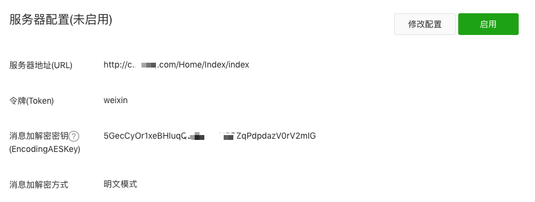

# wechat
>手把手实现微信网页授权和微信支付，附源代码（VUE and thinkPHP）

## 概述

公众号开发是痛苦的，痛苦在好多问题开发者文档是没有提到的，是需要你`猜`的. 在开发过程中翻了好多的文档，都是说明其中的一部分问题的，很费时间,所以在此总结大体过程。我们模拟的是一个支付的商城，在实现购买过程中基本是把微信公众号`最主要模块`实现了，其余的功能我们没有涉及，但应该是触类旁通的。

**我们叙述的过程是按`开发流程`进行叙述的，不会是按照`开发文档`的形式叙述，希望您能结合[微信的开发文档](https://mp.weixin.qq.com/wiki?t=resource/res_main&id=mp1445241432)一起阅读，当然在流程中我们会提醒你阅读的部分**

主要模块：
    
    1. 微信授权
    2. 微信公众号支付
    3. 消息推送(PHP)
    3. 微信扫一扫

## 目录


#### 解决的问题

- [x]  微信网页授权
- [x]  公众号支付
- [x]  公众号分享
- [x]  公众号扫一扫
- [x]  微信后台获取webapp(spa-vue)路由，导致 invalid 问题
- [x]  前端history.pushState()导致ios失效问题
- [x]  换取微信openID 顺序问题
- [x]  网页授权后强制登录官网账户，全局进行拦截
- [x]  前端反向代理


####  前端技术栈

vue2 + vuex + vue-router + webpack + ES6/7 + axios + sass + flex 

####  后端技术栈

thinkPHP3.2 + mysql + 阿里云

####  前端项目运行

```
git clone https://github.com/bailicangdu/vue2-elm.git  
```

``` bash
# install dependencies
npm install

# serve with hot reload at localhost:8080
npm run dev

# build for production with minification
npm run build
```


#### 基本说明

>  开发环境 macOS 10.13.3   nodejs 8.0.0  centOS 7.4 


>  如有问题请直接在 Issues 中提，或者您发现问题并有非常好的解决方案，欢迎 PR

>  本着`线上线下一样`的原则，最好申请两个认证微信公众号，一个是发布使用，一个是本地开发使用。微信自带提供的微信测试功能也不太好用


## 开发过程

### 0.准备
    
请阅读以下微信开发者文档

[首页](https://mp.weixin.qq.com/wiki?t=resource/res_main&id=mp1445241432)

[开发者规范](https://mp.weixin.qq.com/wiki?t=resource/res_main&id=mp1421137025)

[公众号接口权限说明](https://mp.weixin.qq.com/wiki?t=resource/res_main&id=mp1433401084) 

[全局返回码说明](https://mp.weixin.qq.com/wiki?t=resource/res_main&id=mp1433747234) 

### 1.基本配置
>  此部分对应文档的 [入门指引](https://mp.weixin.qq.com/wiki?t=resource/res_main&id=mp1472017492_58YV5) [接入指南](https://mp.weixin.qq.com/wiki?t=resource/res_main&id=mp1421135319)

1. 基础工具
    
    * 一个已经认证的公众号（就是你已经交300元）
    * 已经备案的域名
    * 域名解析到服务器 传送门[node项目发布+域名及其二级域名配置+nginx反向代理+pm2](https://www.jianshu.com/p/c781c108226a)
    * [微信开发者工具下载](https://mp.weixin.qq.com/wiki?t=resource/res_main&id=mp1455784140) : 微信开发可定使用这个工具。必须把前端代码放到》服务器上》用这个工具调试。请仔细阅读[微信web开发者工具 使用指南](https://mp.weixin.qq.com/wiki?t=resource/res_main&id=mp1455784140)

2. 设置`web开发者工具`

    在`开发-开发者工具-web开发者工具`设置开发者账号

3. 设置IP 白名单
    
    在`设置-安全中心-IP白名单设置你服务器的IP`，通过开发者ID及密码调用获取access_token接口时，需要设置访问来源IP为白名单。

4. 设置基本配置-开发者ID
    
    设置开发者密码（AppSecret）

    

    我们获取到的AppSecret (eg) a66b789009df271cde47aaaaaaa
 
5. 设置服务器基本配置 
    
    这部的目的是为了和微信服务器建立联系， 通过微信平台实现我们的业务逻辑。
    
    

    详细版：

    

    接入微信公众平台开发，开发者需要按照如下步骤完成：

    1、填写服务器配置

    2、验证服务器地址的有效性

    3、依据接口文档实现业务逻辑

    下面详细介绍这3个步骤。

    **第一步：填写服务器配置**

        * 登录微信公众平台官网后，在公众平台官网的开发-基本设置页面，勾选协议成为开发者，点击“修改配置”按钮、。

        * 填写服务器地址（URL）、Token和EncodingAESKey

        * URL是开发者用来接收微信消息和事件的接口URL。

        * Token可由开发者可以任意填写，用作生成签名（该Token会和接口URL中包含的Token进行比对，从而验证安全性）

        * EncodingAESKey由开发者手动填写或随机生成，将用作消息体加解密密钥。

        * 同时，开发者可选择消息加解密方式：明文模式、兼容模式和安全模式。模式的选择与服务器配置在提交后都会立即生效

        * 加解密方式的默认状态为明文模式，选择兼容模式和安全模式需要提前配置好相关加解密代码


     




  **第二步：验证消息的确来自微信服务器**
    
现在如果你点击`确认` 按钮，肯定会报认证错误。因为我们没有做`微信认证请求` 接收。  开发者提交信息后，微信服务器将发送GET请求到`填写的服务器地址URL`上，GET请求携带参数如下表所示：
    

|        参数        | 描述       |
| :--------------  |:--------- |
| signature         | 微信加密签名，signature结合了开发者填写的token参数和请求中的timestamp参数、nonce参数
| nonce             | 令客户端重定向至指定URI
| timestamp         | 时间戳
| echostr           | 随机字符串

开发者通过检验signature对请求进行校验（下面有校验方式）。若确认此次GET请求来自微信服务器，请原样返回echostr参数内容，则接入生效，成为开发者成功，否则接入失败。加密/校验流程如下：

1. 将token、timestamp、nonce三个参数进行字典序排序 
2. 将三个参数字符串拼接成一个字符串进行sha1加密 
3. 开发者获得加密后的字符串可与signature对比，标识该请求来源于微信


请后台继续填写
原则： 
1 提供示例代码，和位置
2. 可以把中科的公众号清空，一步一步的演示
3. 注意拿各种认证数据（如openid ）的顺序和时间，最好提供图标说明


### 2.网页授权（共同完成）

**如果使用支付功能，必须先授权**

大家应该经历过，我们在公众号打开页面，一般都会弹出一个按钮需要我们点击同意才会继续浏览页面


但是我们第二次点击的时候是不需要的，这两个过程是不同的，是`两种授权`：（样例不可直接使用，是demo）

* 非静默授权的 URL 样例：

    `https://open.weixin.qq.com/connect/oauth2/authorize?appid=wx841a97238d9e17b2&redirect_uri=http://cps.dianping.com/weiXinRedirect&response_type=code&scope=snsapi_userinfo&state=type%3Dquan%2Curl%3Dhttp%3A%2F%2Fmm.dianping.com%2Fweixin%2Faccount%2Fhome`

    点击`允许`即可带着用户信息跳转到第三方页面，如上图

* 静默授权的 URL 样例： 

    `https://open.weixin.qq.com/connect/oauth2/authorize?appid=wx841a97238d9e17b2&redirect_uri=http://cps.dianping.com/weiXinRedirect&response_type=code&scope=snsapi_base&state=type%3Dquan%2Curl%3Dhttp%3A%2F%2Fmm.dianping.com%2Fweixin%2Faccount%2Fhome`

    在微信 web 开发者工具中打开类似的授权页 URL 则会`自动跳转`到第三方页面。


前端部分： 


